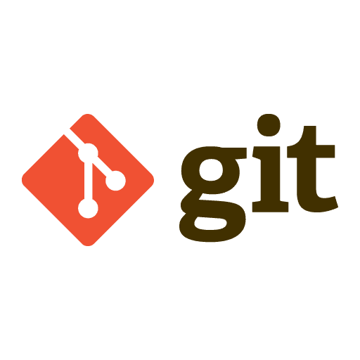
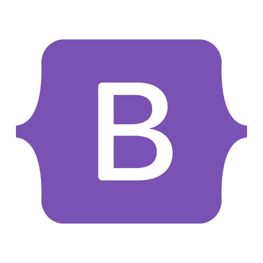
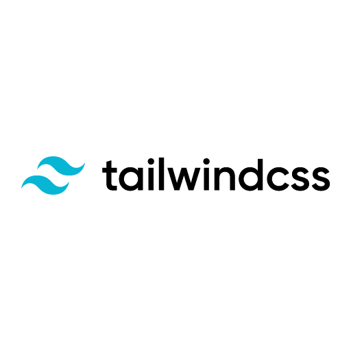
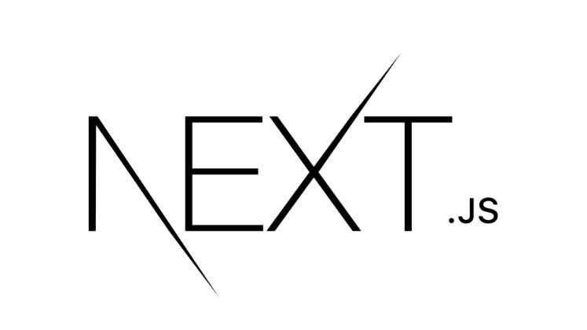

<h1>Hi, I'm Hilton Rodrigo 👋🏽</h1>

###

<h2>About Me:</h2>

###

- :earth_americas: I'm from Brazil

###

- 📍 Salvador - BA

###

- ♻️ I'm an environmental engineer in career transition

###

- 👨🏽‍💻 I'm currently studying programming (Frontend Development at One Bit Code)

###

- 📫 How to reach me: <a href="https://www.linkedin.com/in/hrodrigomota/" target="_blank">Linkedin</a>, <a href="https://www.instagram.com/hrodrigomota" target="_blank">Instagram</a>

###

<h2>Hard Skills (Languages and Tools):</h2>

###

   
  
  
  
  
  
  
  
  
  
  

<!--
**hrodrigomota/hrodrigomota** is a ✨ _special_ ✨ repository because its `README.md` (this file) appears on your GitHub profile.

Here are some ideas to get you started:

- 🔭 I’m currently working on ...
- 🌱 I’m currently learning ...
- 👯 I’m looking to collaborate on ...
- 🤔 I’m looking for help with ...
- 💬 Ask me about ...
- 📫 How to reach me: ...
- 😄 Pronouns: ...
- ⚡ Fun fact: ...
-->
